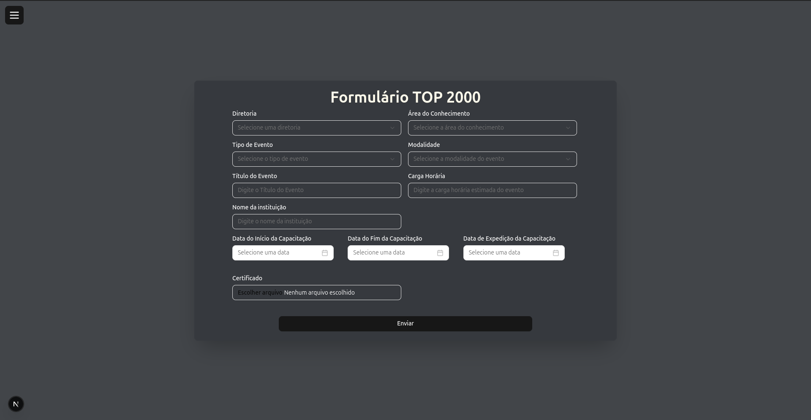
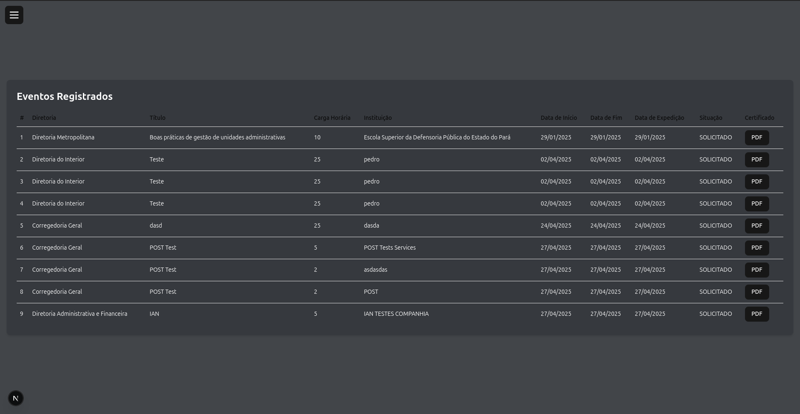

# 🚀 scpc-form-challenge




This is a simple project developed as part of a challenge during my trainee tasks. Using Next.js, React Hook Form, Zod, Tailwind, and ShadCN components, I created a basic form with text fields, select inputs, and a PDF file upload. The form data is sent to an endpoint, and after submission, the information can be viewed in a table that retrieves the data from the same endpoint.

## 💻 Installation

First, you must clone the repository:

```bash
git clone https://github.com/pedroalvesss/scpc-form-challenge/
```

Then, you must install the dependecies. (if you use yarn, i have a advice to you: dont use)

```bash
npm install
```

And finally to run the project:

```bash
npm run dev
```

## License

MIT License

Copyright (c) 2025 Pedro Alves

Permission is hereby granted, free of charge, to any person obtaining a copy
of this software and associated documentation files (the "Software"), to deal
in the Software without restriction, including without limitation the rights
to use, copy, modify, merge, publish, distribute, sublicense, and/or sell
copies of the Software, and to permit persons to whom the Software is
furnished to do so, subject to the following conditions:

The above copyright notice and this permission notice shall be included in all
copies or substantial portions of the Software.

THE SOFTWARE IS PROVIDED "AS IS", WITHOUT WARRANTY OF ANY KIND, EXPRESS OR
IMPLIED, INCLUDING BUT NOT LIMITED TO THE WARRANTIES OF MERCHANTABILITY,
FITNESS FOR A PARTICULAR PURPOSE AND NONINFRINGEMENT. IN NO EVENT SHALL THE
AUTHORS OR COPYRIGHT HOLDERS BE LIABLE FOR ANY CLAIM, DAMAGES OR OTHER
LIABILITY, WHETHER IN AN ACTION OF CONTRACT, TORT OR OTHERWISE, ARISING FROM,
OUT OF OR IN CONNECTION WITH THE SOFTWARE OR THE USE OR OTHER DEALINGS IN THE
SOFTWARE.
